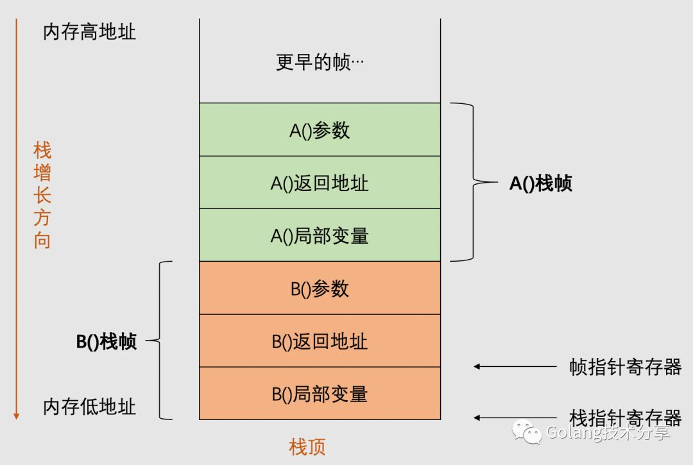

# 逃逸分析

## 堆和栈

栈区存储着函数参数、局部变量、调用函数帧。函数帧描述函数调用关系，每一帧都代表着一次函数调用，且本身以栈形式存放数据。下图是函数栈帧。


堆是另外一个内存区域，是所有goroutine的共用的，在堆上分配内存要考虑锁以及内存碎片问题（Golang为了解决缓解这个问题，采用了3层堆。第一层是每个P都会有一个mcache，共用的mcentral和mheap）。
在栈上就无需考虑锁和内存碎片的问题，每个goroutine的栈是独有的，函数执行完之后栈空间立马释放。无需考虑锁、内存分片，有助于GC。

## 逃逸分析

从上面看，在栈中分配内存有极大的优势，因此能在栈中分配的内存尽量在栈中分配。但是并不是所有场景下都在栈中分配内存合适。逃逸分析就是在编译期间编译器判断对象是在栈中分配内存空间还是堆中分配内存空间的。
PS:在Golang官网的FAQ中有介绍到怎么判断对象是在栈中分配的还是在堆中分配的。<https://go.dev/doc/faq#stack_or_heap>

下面给出几种在堆中分配对象的场景

### 场景一：函数返回一个指针，该指针指向的变量在堆中分配

```Go
package main

import "fmt"

func main() {
  m := a()
	fmt.Println(*m)
}

func a() *int {
	n := 5
	return &n
}
```
执行go build -gcflags '=m -l'，输出如下
```
# execise
./main.go:11:2: moved to heap: n
./main.go:7:13: ... argument does not escape
./main.go:7:14: *m escapes to heap
```

可以看出n是在堆中分配的，因为函数a的返回值是n的指针。
在14行，*m也是在堆中分配的，是下面的场景。

### 场景二： 变量的类型不确定

```Go
package main

import "fmt"

func main() {
	a := 5
	fmt.Println(a)
}
```
编译结果如下
```Text
yangcong@zhukaideMacBook-Pro-> go build -gcflags '-m -l'
# execise
./main.go:7:13: ... argument does not escape
./main.go:7:13: a escapes to heap
```
在第7行fmt.Println方法中，a逃逸到heap中。

### 场景三：分配的内存很大

```Go
package main

func main() {
	b1 := make([]byte, 1<<16)
	b2 := make([]byte, 1<<16+1)

	o(b1)
	o(b2)
}

func o(b []byte) {}
```
编译的输出结果如下
```Text
yangcong@zhukaideMacBook-Pro-> go build -gcflags '-m -l'
# execise
./main.go:11:8: b does not escape
./main.go:4:12: make([]byte, 1 << 16) does not escape
./main.go:5:12: make([]byte, 1 << 16 + 1) escapes to heap
```
b1在栈上分配，b2在堆上分配。

### 场景三：分配的内存空间大小是动态的，在编译时期不能确定

```Go
package main

func main() {
	l := 1
	b1 := make([]byte, l)

	o(b1)
}

func o(b []byte) {}
```
编译输出的结果是
```Text
yangcong@zhukaideMacBook-Pro-> go build -gcflags '-m -l'
# execise
./main.go:10:8: b does not escape
./main.go:5:12: make([]byte, l) escapes to heap
```
b1的长度是1，在堆中分配的。

## 函数参数是传递指针比较好，还是传递值比较好？

在向函数传递参数的时候，无论是指针还是值都会进行拷贝。如果传递的是大结构体，那么拷贝的开销会大一些（相对于指针拷贝）。如果是指传递，那么能减小gc的压力。