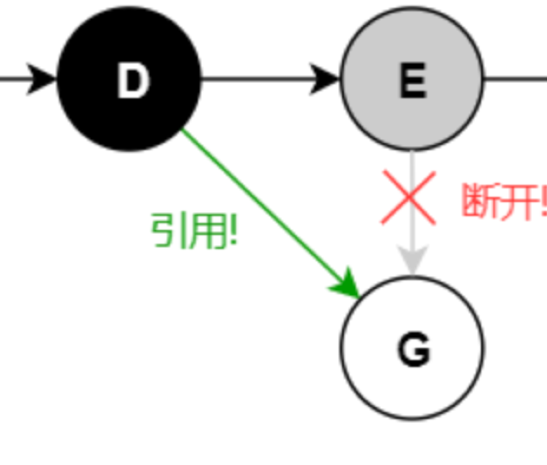

# Golang GC

内存垃圾回收机制。

## 常见的GC算法

主要是追踪算法（标记清除）和引用计数算法。

1. 标记清除，从根对象出发，根据对象之间的引用关系，进行扫描，那些未被扫描到的对象就是无用对象，需要被清除。Go、Java、NodeJS都是这种。
2. 引用计数算法，每个对象自身包含一个被引用的计数器，计数器为0时，表示需要被回收。Python是这种。

<strong>引用计数算法怎么解决循环引用的问题？</strong>

```Java
MyObject myObject1 =newMyObject();
MyObject myObject2 =newMyObject();
myObject1.ref = myObject2;
myObject2.ref = myObject1;
myObject1 =null;
myObject2 =null;
```
上面的代码实现了两个变量相互引用，切计数器都是1。

能解决，但是成本很大。当引用关系被删除的时候，需要判断对象存不存在循环引用，如果除了循环引用之外的引用计数为0，那么可以回收。
问题是判断循环引用的成本很大，如果是两个对象相互引用这种判断成本不高，如果是由多个对象组成的一个环状循环引用，这种判断成本就非常高。因此想在引用计数算法中解决循环引用的问题成本就很高。

python中是以引用计数算法为主，标记清除算法为辅。

<strong>标记清扫算法中一些常见的点</strong>

1. 分代方法，NodeJS中就采用了这种方法。新生代空间小，GC频率相对高一些。老生代空间大，GC频率相对低一些。
2. 增量式：将标记、清扫拆分来处理，减少对业务的影响。
3. 标记整理：减少内存碎片。

在Go中，内存分配采用的tcmalloc，内存碎片问题较少。并且在Go中会优先在栈中分配对象，goroutine结束之后，栈空间回收，这和分代的思想很像。因此Go团队关注于GC与业务代码的并发执行上。

Go中在三种场景下会触发GC
1. 手动调用runtime.GC方法
2. 超过2分钟还没有GC
3. 步调算法

## Go的三色标记

### Root集合对象

全局对象，例如：server中数据库连接池，栈空间中的对象。

### 三色标记

初始状态下，所有对象都是白色。将Root集合对象标记成灰色且存储到灰色队列中。遍历灰色队列中的对象，将其置为黑色，且将其引用的对象置为灰色放到灰色队列中。
遍历结束之后，清除所有白色的对象。

### 三色标记与STW

在执行三色标记的过程中，需要停止其他goroutine（STW），让go进程只做三色标记一件事情。如果三色标过程中其他gorotuine不停止的话，会存下面的问题。


1. goroutine创建了白色对象G，让E指向G
2. 让黑色D指向G，且断开E指向G
在这种情况下G是无法被回收的。

如果能解决这个问题，那么三色标记的时候就不需要STW。

### 强弱三色不变性和写屏障

针对上面的问题，Go团队提出了强弱三色不变形。
1. 强三色不变性：黑色对象不能指向白色对象
2. 弱三色不变性：黑色对象可以指向一个白色对象，但是白色对象同时必须在一个灰色对象的可达链上（存在一个灰色对象能够找到这个白色对象）。

<strong>插入写屏障</strong>

如果黑色对象新增一个引用指向白色对象的时候，需要将白色对象置为灰色。如果黑色对象是在栈中，那么不执行写屏障操作，因为栈上的操作很频繁，如果执行写屏障操作的话，那么开销会很大。

为了解决这个问题，在三色扫描之后，需要STW，针对栈上的对象再扫描一次。
FIXME:如果栈空间对象（黑色）引用了一个堆空间对象（白色），那么会触发插入写屏障吗？最大的问题

<strong>删除写屏障</strong>

如果删除一个灰色对象对一个白色对象的引用，需要将白色对象置为灰色。原因是：可能存在黑色对象指向这个白色对象。
这样的话，会存在回收精度问题，假设不存在黑色对象指向这个对象，由于被置为灰色，只能等下一轮被回收。

<strong>混合写屏障</strong>

混合写屏障解决了二者的缺点，采用了下面的方案：

1. GC开始的时候，将栈上的所有对象标记成黑色（解决了插入屏障的二次扫描的问题）
2. GC期间，任何在栈上新建的对象均是黑色
3. 被删除的对象被标记成灰色
4. 被添加的对象标记成灰色
