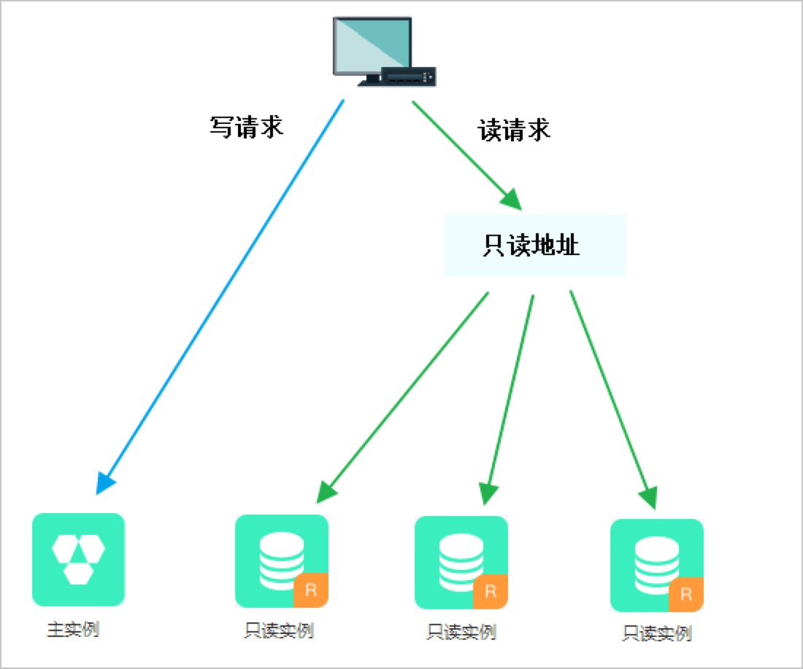

# mysql读写分离架构

```读写分离是什么？解决什么问题？```

读写分离是通过增加数据库实例来分担读压力，从而提升数据库负载能力的。如下图

从上图可以看出，读写操作分开了，在不同数据库实例上执行的。
要实现这个架构，那么要解决如下几个问题。

## 问题一：从库如何获得数据以及数据一致性

写操作都在主库上执行的，如何将主库的数据复制到从库中？主从库的数据同步采用mysql的复制技术。
mysql的复制技术依赖于binlog实现的。

binlog是mysql sever层的日志，记录了数据的写操作。mysql提供了一个开关用于是否开启binlog功能，如果要使用复制功能，则必须开启binlog功能。

数据同步的时候，从库会开启两个线程，一个负责从主库获取binlog，将其撞成relay log,一个复制执行relaylog。数据复制相关的会有专门的文章介绍。

mysql复制默认是异步的，异步复制存在一个缺点：如果从库复制延时大，此时主库宕机了，并且系统切换到从库，将从库提升为主库，此时会存在大量的数据丢失。

在5.5版本中，Mysql引入了半同步复制的机制，至少一个从库复制了数据之后，主库才会给客户端响应。
``这里我存在一个疑问：如果在同步的时候超时了，或者从库失败了，主库返回给客户端什么？是返回成功还是返回失败？``


