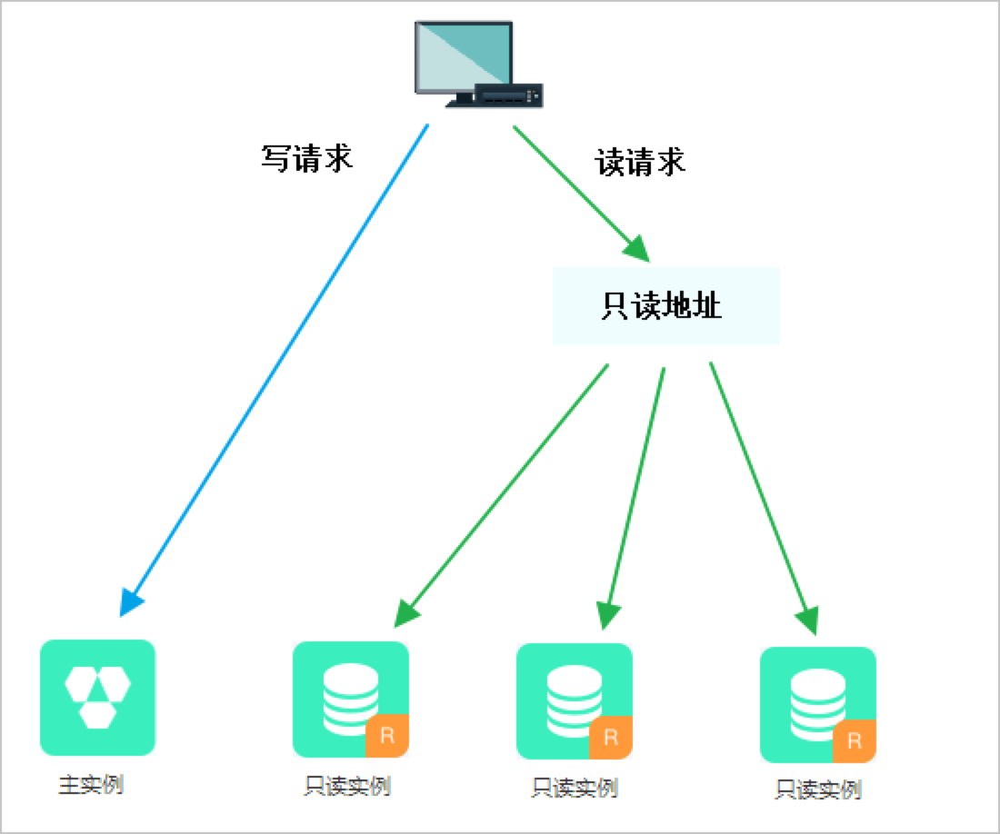

# mysql读写分离架构

```读写分离是什么？解决什么问题？```

读写分离是通过增加数据库实例来分担读压力，从而提升数据库负载能力的。如下图

从上图可以看出，读写操作分开了，在不同数据库实例上执行的。
要实现这个架构，那么要解决如下几个问题。

## 问题一：从库如何获得数据以及数据一致性

写操作都在主库上执行的，如何将主库的数据复制到从库中？主从库的数据同步采用mysql的复制技术。
mysql的复制技术依赖于binlog实现的。

binlog是mysql sever层的日志，记录了数据的写操作。mysql提供了一个开关用于是否开启binlog功能，如果要使用复制功能，则必须开启binlog功能。

数据同步的时候，从库会开启两个线程，一个负责从主库获取binlog，将其撞成relay log,一个复制执行relaylog。数据复制相关的会有专门的文章介绍。

mysql复制默认是异步的，异步复制存在一个缺点：如果从库复制延时大，此时主库宕机了，并且系统切换到从库，将从库提升为主库，此时会存在大量的数据丢失。

在5.5版本中，Mysql引入了半同步复制的机制，至少一个从库复制了数据之后，主库才会给客户端响应。
``这里我存在一个疑问：如果在同步的时候超时了，或者从库失败了，主库返回给客户端什么？是返回成功还是返回失败？``
我猜测返回的仍然是成功。

还有一种方式叫全同步复制，这种方案，性能差，不建议使用。

在数据一致性上，仍然无法做到强一致性，在某个特殊的场景下，为了保证数据的一致性，必须从主库中读取数据。
例如：创建订单之后进入订单详情页，在订单详情页中查询订单的请求必须从主库中读取，此时从库可能尚未同步到数据。

上面是举例了一个数据强一致性的场景，在那些并不需要保证强一致性的场景下，都从从库中读取。例如：订单列表页查询订单列表。

## 问题二：如何实现请求的路由分发？

数据库有多个实例，怎么实现在路由方案呢？有两种方案
一种是通过代理，一种是在客户端路由。


上图是代理模式，客户端连接到代理上，由代理来路由sql请求。代理这种方案有 https://github.com/alibaba/atlas


上图是客户端路由模式，客户端同时与主从数据库都保持连接，由客户端决定sql发往哪个数据库。一般情况下，都会集成一个支持这种功能的sdk。

对比一下这两种方案的优缺点

客户端路由模式的缺点
1. 如果客户端是多种语言，那么集成的SDK需要支持多种语言，加大了维护成本
2. 数据库对于客户端而言是可见的，如果要新增一个数据库实例，那么客户端需要添加配置并且重启服务

客户端路由模式的优点
1. 客户端与数据库直连，中间无IO消耗

代理模式缺点
1. 代理服务转发sql，增加了一层IO消耗

代理模式优点
1. 客户端只与代理服务相连，无语言区分
2. 数据库实例对于客户端而言不可见，当增加实例的时候，客户端无需做任何操作
