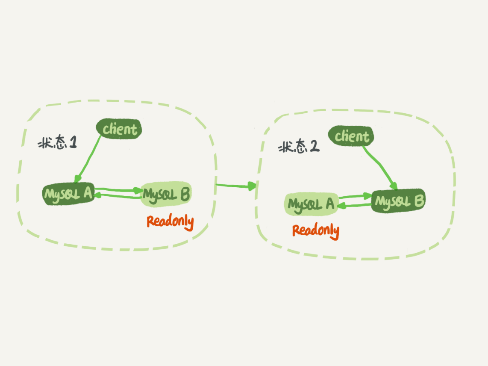
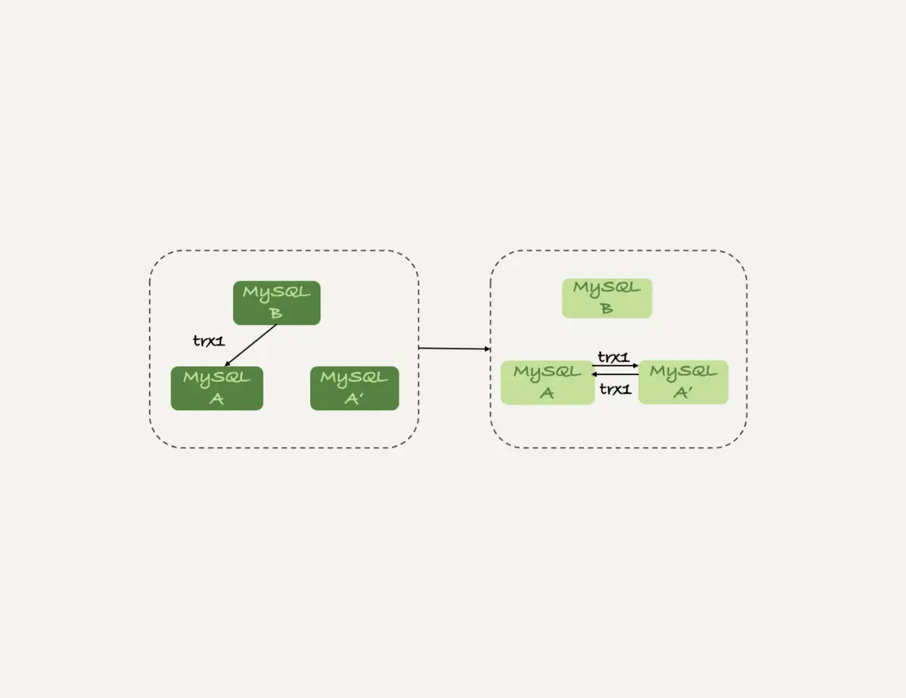

# Mysql主备一致的问题

## 主备复制的流程

1. 从机执行``CHANGE MASTER TO``命令，指定主机，以及同步的binlog文件和binlog文件的position。``CHANGE MASTER TO``指定的文档可参看<https://dev.mysql.com/doc/refman/8.0/en/change-master-to.html>。
2. 从机上执行``START SLAVE``命令从机启动两个线程，一个叫IO线程，负责从主机获取binlog，将binlog存储到本地的relay log。relay log叫中继日志。另外一个线程叫SQL线程，读取relay log，然后执行。

从上面看，主从复制中SQL线程是单线程，现在版本中是多线程。要实现多线程，需要解决并发问题。
主备复制架构历史也很有意思，可以参看<https://cloud.tencent.com/developer/article/1544449>。

## binlog的格式

<strong>查看binlog是否开启</strong>
``show variables like 'log_bin';`` ，ON表示已经开启

<strong>如何开启binlog</strong>
修改配置文件，然后重启

<strong>查看binlog格式</strong>
``show variables like 'binlog_format';``

<strong>查看有哪些binlog文件</strong>
``show binary logs``

<strong>查看binlog文件内容</strong>
``show binlog events in 'binlog-file-name'``

<strong>查看当前正在使用的是哪个binlog以及position</strong>
``show master status``

mysql支持三种格式的binlog，分别是``statement``和``row``和``mixed``。

``statement``格式的日志存储的是sql语句。``row``格式的日志存储的是sql写操作的所有信息变更。delete前、update前后、insert后。

对比这两种类型：
statement类型，存储的是客户端发过来的sql原文。如果主库和从库上下文不一致，那么可能会引起主备数据不一致。
例如：执行``delete user where a >= 4 and modified >= '2022-02-02' limit 1;``，如果在主库利用的是``索引a``从库利用的是索引``modified``，那么删除的数据很可能不一样。
由于存储的是sql原文，占用的空间小。

row类型，存储的是每一行数据变更，delete：删除行在删除前的数据；update前后；insert后。不会出现数据不一致的情况，很安全。但是占用空间大。

对于``mixed``类型，由mysql决定存储``statement``还是存储``row``。mysql觉得可能会引起数据不一致，那么存储row，否则存储statement。

一般情况下，还是选择row格式的好，便于恢复数据。假设误操作删除了一条操作，可以通过binlog追溯到原数据。

## Row格式的binlog

数据库的名称叫person,表名叫t。删除了id为75的行。
执行``show binlog events in 'mysql-bin.001300';``，在末尾找到相关记录，记录如下
| Log_name | Pos | Event_Type | Server_id | End_log_pos | Info |
|  ----    | ----|  ----      | ----      | ----        | ----  |
| mysql-bin.001300 | 11678 | Table_map | 20076641 | 11731 | table_id: 235 (personal.t) |
| mysql-bin.001300 | 11731 | Delete_rows_v1 | 20076641 | 11777 | table_id: 235 flags: STMT_END_F |
| mysql-bin.001300 | 11777 | Xid | 20076641 | 11808 | COMMIT /* xid=58211501 */ |

1. Table_map Event表示要操作的是那张表
2. Delete_rows_v1 Event表示操作行为
3. Xid表示这个事务被提交
上面信息不是相信信息，需要借助``mysqlbinlog``工具来查看详细信息。

<strong>如何安装mysqlbinlog工具</strong>
下载<https://downloads.mysql.com/archives/community/>第一个包（非debug包）,解压。bin文件夹下有mysqlbinlog.exe文件（我用的是windows版本）。


执行``.\mysqlbinlog.exe -u {user} -p {passowrd} -h {host} --read-from-remote-server -vv --base64-output=decode-rows mysql-bin.001300 --start-position=11599 > 13000.txt;
 ``
 其中``mysql-bin.001300 ``和``start-position``表示binlog file name和position。
 截取一段详细信息
 ```plain text
 BEGIN
/*!*/;
# at 11678
#220409 11:57:24 server id 20076641  end_log_pos 11731 CRC32 0x8d2ca005 	Table_map: `personal`.`t` mapped to number 235
# at 11731
#220409 11:57:24 server id 20076641  end_log_pos 11777 CRC32 0xbfdb8128 	Delete_rows_v1: table id 235 flags: STMT_END_F
// 注释：下面是删除的详细信息，信息中体现了删除行的所有字段信息
### DELETE FROM `personal`.`t`
### WHERE
###   @1=75 /* INT meta=0 nullable=0 is_null=0 */
###   @2=5 /* INT meta=0 nullable=1 is_null=0 */
###   @3=5 /* INT meta=0 nullable=1 is_null=0 */
# at 11777
#220409 11:57:24 server id 20076641  end_log_pos 11808 CRC32 0x21d61a28 	Xid = 58211501
COMMIT/*!*/;
 ```

## statement类型日志中的now函数问题

这种情况下，binlog中会多一行数据``SET TIMESTAMP=1546134886``来表示now函数的返回值。

## 双MM架构下，循环复制问题


上图是双M架构的架构图，双M架构中，两台主机互为主备，存在循环复制的问题。在备份机制中，mysql引入server id机制来解决这个问题
1. 在备份系统中，不允许主机和从机的server id相同
2. 主机A生成的binlog中包含自己的server id
3. 从机B从主机A获取binlog，然后重放，再生成新的binlog，新的binlog中server id仍然是主机A的server id
4. 主机A从从机B中获取获取到binlog，会判断server id是否与自己的server id相同，如果相同，不执行。

server id在配置在mysql的配置文件中的。在mysql运行过程中也可以通过执行``set global server_id=x;``来修改server id。
如果主机修改了server_id那么就可能出现重复复制的情况。

还有另外一个场景必定会出现重复复制的情况。

如上图，tx1在B上执行，在这在之后如果进行了数据迁移，A和A'搭建了双M架构，这种情况tx1必然会出现重复复制。
``CHANGE MASTER TO``命令中包含``IGNORE_SERVER_IDS``参数，用于指定忽略来自于哪个server id的binlog。
上图示例中，A和A'搭建双M架构的适合，A需要指定忽略来自于B的binlog。

Mysql8``CHANGE MASTER TO``命令的文档链接<https://dev.mysql.com/doc/refman/8.0/en/change-master-to.html>